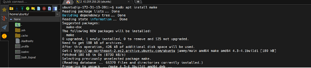

# CI-CD DevSecOps Project with Jenkins | Python Webapp


We will be deploying a python-based application. This is an everyday use case scenario used by several organizations. We will be using Jenkins as a CICD tool and deploying our application on a Docker Container.

**Github:** [Python System Monitoring GitHub Repo](https://github.com/Aj7Ay/Python-System-Monitoring.git)

## Steps:

1. **Step 1** — Create an Ubuntu T2 Large Instance
2. **Step 2** — Install Jenkins, Docker, and Trivy. Create a Sonarqube Container using Docker.
3. **Step 3** — Install Plugins like JDK, Sonarqube Scanner, OWASP Dependency Check.
4. **Step 4** — Create a Pipeline Project in Jenkins using a Declarative Pipeline
5. **Step 5** — Configure Sonar Server in Manage Jenkins
6. **Step 6** — Install and make the package
7. **Step 7** — Docker Image Build and Push
8. **Step 8** — Deploy the image using Docker
9. **Step 9** — Access the Real World Application
10. **Step 10** — Terminate the AWS EC2 Instance

## Now, Let’s Get Started and Dig Deeper Into Each of These Steps:

### Step 1 — Launch an AWS T2 Large Instance.

Use the image as Ubuntu. You can create a new key pair or use an existing one. Enable HTTP and HTTPS settings in the Security Group.


### Step 2 — Install Jenkins, Docker, and Trivy

#### 2A — To Install Jenkins

Connect to your console, and enter these commands to Install Jenkins.

``` 
sudo vi jenkins.sh
```

Enter the below code in the file:

``` 
#!/bin/bash 
sudo apt update -y
wget -O - https://packages.adoptium.net/artifactory/api/gpg/key/public | tee /etc/apt/keyrings/adoptium.asc
echo "deb [signed-by=/etc/apt/keyrings/adoptium.asc] https://packages.adoptium.net/artifactory/deb $(awk -F= '/^VERSION\_CODENAME/{print$2}' /etc/os-release) main" | tee /etc/apt/sources.list.d/adoptium.list
sudo apt update -y
sudo apt install temurin-17-jdk -y
/usr/bin/java --version
curl -fsSL https://pkg.jenkins.io/debian-stable/jenkins.io-2023.key | sudo tee /usr/share/keyrings/jenkins-keyring.asc > /dev/null
echo deb [signed-by=/usr/share/keyrings/jenkins-keyring.asc] https://pkg.jenkins.io/debian-stable binary/ | sudo tee /etc/apt/sources.list.d/jenkins.list > /dev/null
sudo apt-get update -y
sudo apt-get install jenkins -y
sudo systemctl start jenkins
sudo systemctl status jenkins
sudo chmod 777 jenkins.sh
./jenkins.sh
```

Once Jenkins is installed, you will need to go to your AWS EC2 Security Group and open Inbound Port 8080, since Jenkins works on Port 8080.

Now, grab your Public IP Address: `EC2 Public IP Address:8080`

``` 
sudo cat /var/lib/jenkins/secrets/initialAdminPassword
```

Unlock Jenkins using an administrative password and install the required plugins.


Now Jenkins will be installed and install all libraries.


#### 2B — Install Docker

``` 
sudo apt-get update
sudo apt-get install docker.io -y
sudo usermod -aG docker $USER
sudo chmod 777 /var/run/docker.sock
sudo docker ps
```

After the docker installation, create a SonarQube container (Remember to add port 9000 in the security group):

``` 
docker run -d --name sonar -p 9000:9000 sonarqube:lts-community
```

Now, our SonarQube is up and running. Enter the username and password, click on login, and change the password.

**Username:** admin  
**Password:** admin


#### 2C — Install Trivy

``` 
sudo apt-get install wget apt-transport-https gnupg lsb-release -y
wget -qO - https://aquasecurity.github.io/trivy-repo/deb/public.key | gpg --dearmor | sudo tee /usr/share/keyrings/trivy.gpg > /dev/null
echo "deb [signed-by=/usr/share/keyrings/trivy.gpg] https://aquasecurity.github.io/trivy-repo/deb $(lsb_release -sc) main" | sudo tee -a /etc/apt/sources.list.d/trivy.list
sudo apt-get update
sudo apt-get install trivy -y
```

Next, log in to Jenkins and start configuring your Pipeline in Jenkins.

### Step 3 — Install Plugins like JDK, Sonarqube Scanner, OWASP Dependency Check.

#### 3A — Install Plugins

Go to **Manage Jenkins → Plugins → Available Plugins** and install the following:

- OWASP Dependency Check (Install without restart)
- SonarQube Scanner (Install without restart)
- Eclipse Temurin Installer (Install without restart)


#### 3B — Configure Java and Maven in Global Tool Configuration

Go to **Manage Jenkins → Tools → Install JDK** and click on Apply and Save.


#### 3C — Create a Job

Label it as **Dotnet CI-CD**, click on Pipeline, and then OK.

### Step 4 — Install OWASP Dependency Check Plugins

Go to **Dashboard → Manage Jenkins → Plugins → OWASP Dependency-Check**, click on it, and install it without restart.


### Step 5 — Configure Sonar Server in Manage Jenkins

Grab the Public IP Address of your EC2 Instance, SonarQube works on Port 9000, so use `<Public IP>:9000`. Go to your SonarQube Server. Click on **Administration → Security → Users → Click on Tokens**, and update the token.


Click on **Generate Token** and copy it.

Go to **Dashboard → Manage Jenkins → Credentials → Add Secret Text** and input your token.


Now, go to **Dashboard → Manage Jenkins → Configure System** and click on Apply and Save.

### Step 6 — Install Make Package

```
sudo apt install make
# To check if installed successfully
make -v
```



### Step 7 — Docker Image Build and Push

Go to **Dashboard → Manage Jenkins → Tools** and install the following plugins:

- Docker
- Docker Commons
- Docker Pipeline
- Docker API
- docker-build-step

And click on install without restart.

Next, go to **Dashboard → Manage Jenkins → Tools →** and add your DockerHub credentials under **Global Credentials**.

In the `Makefile`, we define some conditions to build, tag, and push images to DockerHub.

``` 
make image
make push
```

### Step 8 — Deploy the Image Using Docker

Add this stage to your pipeline script:

```groovy
stage("Deploy to container") {
    steps {
        sh "docker run -d --name python1 -p 5000:5000 sevenajay/python-system-monitoring:latest"
    }
}
```

### Step 9 — Access the Real World Application


### Step 10 — Terminate the AWS EC2 Instance

Do not forget to terminate the AWS EC2 Instance.
